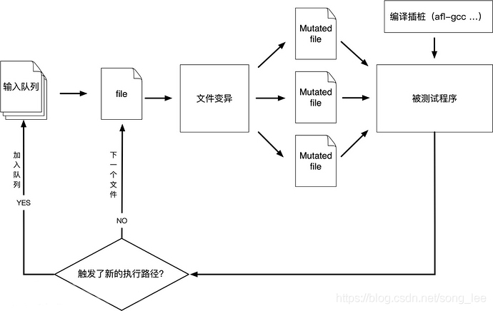

# afl-fuzz程序解析

## 流程简图




## 函数解析
注： 此笔记使用的afl源码为afl-0.47b版本，是最早的一个发行版本，afl的最新版本为2.52b版本，之所以阅读这个版本，代码量最小，而且afl框架从发行就没有大的改动，阅读这个版本方便快速掌握精髓。

### u8 run_target(char** argv)

运行case（queue_cur），收集运行结果（fault)。

通过pipe与forksrv（在target内部）通信。发送指令，forksrv调用fork()运行target。

通过pipe接收target运行状态，根据status和超时指标child_timed_out判断运行结果。

在读取case文件的内容时，使用mmap（）进行了私有文件映射。

```
falut:
enum{
	FAULT_NONE,	/* 正常执行 */
	FAULT_HANG,	/* 超时 */
	FAULT_CRASH, /* WIFSIGNALED(status) */
	FAULT_ERROR,	/* WEXITSTATUS(status) == EXEC_FAIL */
	
}
```

**TODO:**这里判断target是否执行出错(FAULT_ERROR)取决于目标程序，依赖于目标程序执行exit(EXEC_FAIL)来处理异常退出。在实际情况下需要根据target修改，或者改变监测方法，实际上在最新afl版本中处理了这个问题。

### u32 count_bits(u8* mem)

功能：计算trace_bits（每个case的shm）中被置位的比特数目。算法只使用三行代码，采用位移和加减运算，这样做的目的在于提升运算速度，cpu擅长做位移和整数加减运算。这个函数在每次run_target()后，即每跑一次case，都要计算一次，返回值即作为case的bitmap_size指标。

### void classify_counts(u8* mem)

将trace_bits中每个字节的计数归类，按照下表这样的table进行归类，实际代码中并没有用查表，而是使用了switch。**目的在于将每个tuple的命中计数归置为1个bit（该bit依次分布在byte的8个bit位）。目的在于为后续计算bitmap_size指标先行处理**。

```
static const u8 count_class_lookup8[256] = {

  [0]           = 0, 
  [1]           = 1, 
  [2]           = 2, 
  [3]           = 4, 
  [4 ... 7]     = 8, 
  [8 ... 15]    = 16,
  [16 ... 31]   = 32,
  [32 ... 127]  = 64,
  [128 ... 255] = 128

};
```

### u8 has_new_bits()

遍历trace_bits，检查是trace_bits比以前的用例是否产生了新变化，同步更新virgin_bits。

返回2代表有新路径产生，1代表只有tuples的执行次数发生了变化。0代表没有任何变化。

注意virgin是trace的取反，这样通过两者的相与，很容易就能判断是否产生了变化。而与运算适合cpu运算，在遍历整个trace_bits空间的情况下达到优化运算速度的效果。

### u8 check_update_count(u8* dir)

控制hang和crash每个类型存储的激励数量，防止占用过多硬盘空间。在hang/crash目录中每个子目录中创建.count文件，记录已录入的激励文件个数。返回结果为是否超出设定。

### void save_if_interesting(void* mem , u32 len, u8 fault)

​	mem : case的缓冲区，存储内容；

​	len : case长度；

​	fault: run_target()运算case后的返回结果。

功能：

1. 检查case运算的结果，挑出好的结果加入队列作为种子。筛选因子:是否有新的变化（has_new_bits()）。

2. 记录下造成Hang和Crash的用例，输出到文件。

用于记录有用的变异激励：在common_fuzz_stuff()中调用，而common_fuzz_stuff()函数仅在fuzz_one()函数中调用，用作对case变异后再run_target()。

### void add_to_queue(u8* fname, u32 len, u8 passed_det)

向队列添加testcase。

### void update_bitmap_score(struct  queue_entry* q)

每当有新case进入queue时，调用该函数，为每个case打分。更新top_rated[]数组。top_rated[]记录每个tuple被命中的分数最优case.

这个操作为cull_queue()函数标记优质种子更新top_rated[]数组。

### void cull_queue()

查找优秀的种子激励，将其标记为“favored”，标准如下：

遍历top_rated[]（top_rated[]标记了击中每个tuple的最优种子激励），然后提取出发现新tuple的case，并标记为favored，使得在下次遍历queue时，这些case能获得更多执行fuzz的机会。

被标记为favored的case组成的子集，仍覆盖到目前为止所看到的每个tuple，并且其特征使它们对Fuzzing特别有利。

每当对一个种子进行多样化变异后（在fuzz_one()中进行），就调用该函数进行优化。另外一个时机是在perform_dry_run()后调用，即优化初始的队列。

### u8 fuzz_one(char** argv)

afl变异策略的执行函数，是afl-fuzz程度的主要函数（1/4）。对queue_cur(队列中的当下case)依次进行FLIP、Arithmetic、Interest、Havoc、Splicing等变异策略，每次变异对case的缓冲区进行变形操作，数据喂给common_fuzz_stuff()函数。变异策略另述，这一块也是很多魔改的点。

执行变异执行前，先调用calibration()函数对case进行校准，然后调用trim()函数裁减case。

成功执行返回0,跳过queue_cur用例，返回1.

### u8 common_fuzz_stuff(char** argv, u8 out_buf[], u32 len)

out_buf为激励内容，len为长度，调用run_target()。

调用save_if_interesting(outbuf, len ,fault)处理返回结果。

### void write_with_gap(void\* mem, u32 len, u32 skip_at, u32 skip_len)

mem: case buffer

len: buffer length

skip_at:删除片段的起始偏移

skip_len:删除片段的长度

删除从skip_at开始长度为skip_len的片段，将其余内容重新拼接为新case.

### void write_to_testcase(void *mem, u32 len)

将case缓冲区内容写入输出文件，这个输出文件就是target的参数，target作用于此文件。默认为.cur_input文件，每次调用run_target()前将激励写入该文件。

### u8 trim_case(char\*\* argv, struct queue_entry* q, u8* in_buf)

在不改变case的tuple的命中结果(trace_bits)情况下，尽量降低其规模，以提高运行速度。在fuzz_one()函数中执行变异策略前进行调用，优化种子case的规模。

函数内部变量remove_pos为删减片段的起始偏移，trim_avail为删减片段长度。调用write_with_gap（）进行裁减。内部变量remove_len提供了步长，初始步长为len/16，每次步长减短1/2，最短为len/1024。

当发现删减后能够保持case同等的trace_bits命中结果（对比hash)，继续进行迭代删减，否则移动remove_pos，再尝试删减，直到remove_pos位移至结尾。然后缩短步长remove_len，继续删减，直到步长小于最短步长。

这里通过两层迭代反复检测删减，尽量压缩case规模。

成功返回0，如果run_target()运行target执行出错，返回fault == FAULT_ERROR代码，则放弃优化。FAULT_ERROR代表target进程执行出错。

**TODO：**trim使用的裁减策略，在对格式有严格要求的目标时比如交互性强的复杂协议，并不适用，很容易就破坏了格式边界导致target执行出错，无法达到优化目的。对压缩程序等数据处理等文本处理程序较为适合。

独立的afl-tmin程序提供了更加完备的裁减策略。

### u8 calibrate_case(char\*\* argv, struct queue_entry* q, u8* use_mem, u32 handicap, u8 already_ran)

调用run_target()多次运行case，计算并标记运算指标，返回运行结果fault.

调用run_target()之前根据需要设置exec_tmout。

### void perform_dry_run(char** argv)

在main函数中，调用read_testcases()函数，将testcases全部读入queue中，然后调用perform_dry_run()，确定每个测试用例能否正常运行。

内部主要调用了calibrate_case()函数。

### void simplify_trace(u8* mem)

将trace_bits作归一化处理，即将每个被执行的touple对应byte设置为1.

这样做是为了生成unique_crashes和unique_hangs。

在save_if_interesting()中统计结果时，调用该函数，然后再计算trace_bits的hash。hash值作为case签名的一部分，如果hash不同，表明有新的tuple被执行，以此来判定是否是新的特殊用例。

### void add_passed_det(struct queue_entry* q)

记录完成deterministic变异的case至“output_dir/queue/.stata/”目录内，这个目录用于重启被终止的fuzz过程时避免重复执行deterministic变异。只记录文件名字（在”output_dir/queue/”目录中已存在），不写入内容。

### void pivot_input(void)

在“output_dir/queue/”中创建输入用例的硬链接，为其按照规则命名。

### void locate_diffs(u8\* ptr1, u8\* ptr2, u32 len, s32\* first, s32\* last)

查找两块buffer第一个和最后一个内容不同字节的偏移（byte计数）。辅助splicing变异。为变异提供拼接点的位置信息，拼接点splicing_at为first和last之间随机选取的位置。

### u32 choose_block_len(limit)

辅助havoc和splicing随机策略变异。随机生成一定范围内的块长度信息。

### u32 calculate_score(struct queue_entry* q)

avg_exec_us是输入样本的平均执行时间；

avg_bitmap_size是输入样本的平均touple击中数量。

评估当前case的分数，评判标准为:执行时间越短、bitmap_size越大，得分越高。

得分越高，就能够在havoc变异阶段获得更多的执行次数。

分数调整策略：

增加后进入queue激励的得分，越后进入得分调整得越高；

执行深度越深，得分调整得越高。

### u8* describe_op(u8 hnb)

根据种子文件命名规则生成文件名。在add_to_queue()函数中被调用。

### void fix_up_sync(void)

为并行fuzz同步作准备:

调整sync_dir目录为”-o“指定的输出目录，同时在该目录下创建名为”sync_id”的子目录作为该fuzzer的output_dir；

从fuzzer跳过deterministic变异，只进行havoc和splice随机变异。

### void sync_fuzzers(char** argv)

从其它fuzzer得到激励。

同步机制：

目录”sync_dir/fuzzer_xxx/.synced/“中记录了从其它fuzzer等待读取case的id，每个fuzzer一个文件，文件以fuzzer的sync_id命名，比如fuzzer_1的.synced目录中存在fuzzer_2至fuzzer_n 共计n-1个文件，每个文件都简单记录一个id号，为目前等待读取case的id。调用mmap将待读取的case映射为私有文件，完成fuzz后把下一个待读取case的id号写入同步文件。按照上述同步机制逐个遍历每个fuzzer（不包括自己）。

### setup_shm(), setup_dirs_fds(), setup_stdio_file()

fuzz前的准备工作，依次为准备bitmap(shm)；创建输出目录“out_dir”及其子目录，打开/dev/null和/dev/urandom文件；创建target作用的激励文件.cur_input。

值得一提的是，setup_shm()建立了bitmap，通过环境变量通知forksrv(位于target进程)来同步bitmap的地址。

利用环境变量进行父子进程通信：

父进程向其环境块添加一个环境变量，变量的名称应该是子进程知道的一个名称,然后当父进程生成子进程的时候，这个子进程会继承父进程的环境变量，所以能轻松调用getenv()来获得这个环境变量的值。如果子进程还要生成另一个子进程，这种方式就应该非常不错，因为环境变量是可以反复继承的。

### check_binary(), check_terminal(),check_coredumps()

检测target是否存在并且是否是二进制程序；检测屏幕输出；检测coredump文件设置，是否把coredump文件输出给其它程序了。


## 数据结构

### tuple即边

### bitmap_size

trace_bits中被置1的bit总数，代表执行的touple总数。

### trace_bits，virgin_bits[MAP_SIZE]:

bitmap,每个case运行路径(edges)记录在其中。每次运行case前清零。

virgin_bits记录未被执行的touple，累计计入case的bitmap。

### queue_entry:

为每个case维护的结构体信息

```
struct queue_entry {
  u8* fname;      /* File name for the test case */
  u32 len;        /* Input length*/
  u8  cal_done,   /* Calibration completed?  */
      trim_done,  /* Trimmed? */
      was_fuzzed, /* Had any fuzzing done yet?  */
      passed_det, /* Deterministic stages passed?  */
      has_new_cov,  /* Triggers new coverage?  */
      var_behavior, /* Variable behavior?  */
      favored;    /* Currently favored?   */
  u32 bitmap_size;  /* Number of bits set in bitmap   */
  u64 exec_us,      /* Execution time (us)   */
      handicap,     /* Number of queue cycles behind  */
      depth;        /* Path depth   */
  u8* trace_bits;   /* Trace bits, if kept   */
  u32 tc_ref;      /* Trace bits ref count  */
  struct queue_entry *next,    /* Next element, if any  */
                     *next_1k; /* 1000 elements ahead   */
};
```

### queue

​	队列头，队列存储了所有testcases，以及变异生成的有效种子激励（能够击中新的tuple)。

### queue_top

​	队列尾

### queue_cur

当前执行fuzz_one()变异过程的激励

### queue_p1k

第1001个case的queue_entry指针

### queue_cycle

在main()函数中，while(1)循环中一直从queue中取case进行fuzz,当完全遍历一遍queue中后，再重新开始遍历，而queue_cycle加1，它记录了queue被遍历的圈数。

### queue.handicap

等于queue_cycle。代表了种子进入队列的先后次序，初始种子 为0，变异生成的种子的这个值为进入时已经执行的圈数，在calculate_score()计算种子分数时用得到。

### queued_paths

队列中testcase的数量。

### stage_finds[]

每个变异策略阶段目前为止生成的种子数量。

### stage_cycles[]

每个变异策略阶段目前为止的变异执行次数。

### unique_crashes，unique_hangs

特殊签名的崩溃激励数量，也就是生成的crash目录内的目录数量，每个目录代表一类崩溃。签名信息包括：signal，hash。

hang同理。

### top_rated[MAX_SIZE]

top_rated[]数组维护的是所有边的访问情况。其对应关系为，top_rated[i]选取出所有访问到bit_map[i]所代表边的queue中代价（执行时间*文件长度）最小的一个queue。

### queued_variable

标记该case运行时路径会有变化，反映在trace_bits上。queue.var_behavior也是这个含义。

### exec_tmout

target的运行超时上限时间，如果超出，即视作Hang case.

### bytes_trim_in && bytes_trim_out

统计目前为止进入trim的激励字节总数，和trim后生成的激励字节总数。

### splicing_with

和queue_cur进行拼接变异的种子id。

### pending_not_fuzzed

未执行的激励数量。add_to_queue()时加1,在fuzz_one()函数中执行完splicing变异后减1。

### pending_favored

未执行的“favored”激励数量。执行cull_queue()时进行统计，执行完splicing变异后如果queue_cur是“favored”,则减1。

### total_cal_us && total_cal_cycles

total calibration time(us)

total calibration cycles(执行次数)

### total_bitmap_size && total_bitmap_entries

calibration阶段执行的touple总数；

calibration阶段正常执行的激励总数。

### cur_depth && q.depth

depth表明激励是第几代种子，初始种子来源于input_dir目录内的测试用例，他们的depth等于1，作为第一代种子，基于他们变异生成的种子depth逐步递增。 

cur_depth等于queue_cur.depth，表示当前用于变异的种子的繁衍代数。

 add_to_queue()函数中，待进入队列的新种子在cur_depth基础上加1，表明是基于queue_cur种子变异生成的。

### max_depth

记录目前队列中种子的最大depth，表明繁衍的最大代数。

### sync_id

main()函数传入的主/从 fuzzer参数，即-M/S 后跟随的字符串。

### sync_interval_cnt

同步次数计数。

### queued_imported

从其它fuzzer处获得的case总数。


### 种子命名规则

队列中的种子保存在“output_dir/queue/“目录内，”input_dir”目录内的测试用例通过pivot_input()函数硬链接在该目录内，解析describe_op()函数可以得到种子文件命名规则如下：

id:xx,src:xxx[+xxx],op:xxx,pos:xxx,\[val:xxx\][rep:xxx]\[+cov]

id：进入队列的次序；

src： current_entry [+ splicing_with].	

​		current_entry是queue_cur在队列中的id，splicing_with是执行splicing变异策略选择和queue_cur进行拼接激励的id。

op: stage_short

​		变异中间的过程名，如”flip1, arith8,int8, havoc,splice”.

pos: stage_cur_byte

​		deterministic（确定性）变异操作所作用字节的偏移位置。

val: “be”(bigEndian) or stage_cur_val

​		stage_cur_val表示执行变异操作的数值，具体含义与变异策略有关。

rep: stage_cur_val

+cov: hnb==2,即击中新touple。

另外通过同步得到的种子文件命名规则如下：

sync: syncing_party, src: syncing_case

​	syncing_party即目录名”sync_dir/fuzzer_xxx“，表明从哪个fuzzer同步得到的种子；

​	syncing_case即syncing_party目录中待同步case的id。


​	

## 变异策略

### FLIP

```
#define FLIP_BIT(_ar, _b) do { \
    u8* _arf = (u8*)(_ar); \
    u32 _bf = (_b); \
    _arf[(_bf) >> 3] ^= (128 >> ((_bf) & 7)); \
  } while (0)
```

翻转array(_ar)的第\_b比特。这里有两个编程技巧：比特位操作（afl大量使用位操作进行优化）；在#define引入代码块时使用do{...}while(0)（[这样做的好处](https://www.cnblogs.com/fengc5/p/5083134.html)）。

### ARITHMETIC

算术变异，在原激励不同byte/word/dword上进行加减操作。

### HAVOC

“大破坏”，随机破坏

### SPLICING

从queue中随机选取case进行拼接操作，然后执行havoc变异。

afl-fuzz.c**没有pop_from_queue()删除testcase的函数**，原因就是为了执行SPLICING变异，为其提供样本用例。

splicing代码块最后更新了out_buf，然后跳转云执行“goto havoc_stage”，out_buf缓冲区存储了havoc待变异的样本。通过返回前面的havoc代码块，达到了循环执行splicing代码块的目的，执行次数由SPLICING_CYCLES宏定义。


## QEMU mode

利用qemu在动态运行过程中完成对二进制目标程序的轨迹收集。

qemu以程序块为单元，对目标程序进行动态翻译解析和执行。对qemu源码进行patch，在执行block之前插桩，进行轨迹信息收集。afl-qemu-cpu-inl.h对cpu_exec.c进行patch，内部包含了主要的插桩代码。

### 轨迹收集

```cpu_tb_exec(CPUState *cpu, TranslationBlock *itb)```

cpu_tb_exec()是qemu执行翻译后的程序块的函数，每个目标程序被执行的程序块都会进入这个函数，在这里插入AFL_QEMU_CPU_SNIPPET2进行轨迹收集。AFL_QEMU_CPU_SNIPPET2调用afl_maybe_log(itb->pc)，直接使用目标程序block的pc指针作为标识。

### forkserver机制

qemu将已翻译过的block存储在cache中，重复执行已执行过的block时直接执行，不再进行翻译解析。forkserver机制为每个case都会fork出不同的进程来执行，为了共享cache，避免重复翻译解析，使用PIPE(TSL_PIPE)通信，case的子进程通过该通道将block信息(tsl结构体)传递给forkserver，forkserver调用qemu的tb_gen_code()进行记录。因为case子进程会继承forkserver父进程的全局变量，从而完成了cache的共享过程，提高了qemu的执行效率。

qemu tb_htable_lookup(cpu, pc, cs_base, flags)函数查询cache是否命中block，没有的话会调用tb_gen_code(cpu,pc,cs_base,flags,0)来存储新block。tb_htable_lookup()未查询到的情况表明发现了新block，在这里插入AFL_QEMU_CPU_SNIPPET1向forkserver传递新block信息。


## 参考

[AFL使用指南](https://www.cnblogs.com/tomyyyyy/articles/13610206.html)

注：afl-0.47b版本从文件输入时不能使用@@占位符，用法如下：

```afl-fuzz -f tc -i input_dir -o output_dir target_binary tc```

tc作为目录程序的参数传入，同时-f指定tc为激励文件，fuzz过程中每次run_target()前都会将激励提前写入该文件。如果不通过-f指定激励文件，则默认使用“output_dir/.cur_input”文件，fuzz程序会自动创建该文件，并将激励写入，只需要把.cur_input作为参数传入目标程序即可。

[AFL内部实现细节小记，插桩部分写得很好，变异策略也有讲解](http://rk700.github.io/2017/12/28/afl-internals/)

[AFL-Fuzz工具分析，辅助阅读afl-fuzz程序](https://blog.csdn.net/Chen_zju/article/details/80791268?utm_source=blogxgwz6)

[qemu模式下插桩实现细节分析](https://tunnelshade.in/blog/2018/02/afl-internals-qemu-instrumentation/)

[AFL漫谈](https://www.dazhuanlan.com/2019/12/24/5e023308634e5/?__cf_chl_jschl_tk__=605705bb28e1125efffcb35570b88ac1ba8dcbb4-1600397419-0-AVCQozbKg1STXt4uv5zxGj4GQg6hbBU8zvrypxSUMYZNPSPEzIWrTf09kUbhUS0OmWwHFxzLR5jf3g-1xq65o69A3MNhLCdsmsDSroTCTALz_6djoVN3QSTF3_ShXaCUG6JF52IYvQM8nvPFDBfeX2FxvHYRx1-w6RRy_hq0aJE5ZkRvBIlq4-MrBfTGUG_cuDozj1s4G6dfqu3sCUo9TjmFuzWEbrxU6rRImT8lxOGkh2xxiFxdNdsEbBqnoARNrZVCI_JeeIEsfr3HP7OLepJB-5omGhFAV2tr4lmT37WoH3jZtnV-yrO8hZN3PX8_yA)


## relative research

[CollAFL:Path sensitive fuzzing](http://chao.100871.net/papers/oakland18.pdf)

[AFL++,一个优化版，变异策略、速度更快、更优插桩](https://github.com/AFLplusplus/AFLplusplus)


